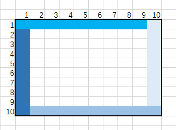

### 41. First Missing Positive

#### Round1

假设数组长度为L, 找到小于L的正整数A，把其放到位置A-1上。

跌倒数组找到位置和值不匹配的第一个值。

---

### 42. Trapping Rain Water

### Round1

这道题的方法是逐个的计算每个格子的蓄水量，然后相叠加。

每个格子的蓄水量为Min(Rmax - Lmax) - Height[i]

基于这个方案，于是有三种方案：

1. broute
2. dp
3. two pointer

dp和two_pointer都是为了加速求出Rmax和Lmax

不过双指针，更加精巧。他利用的隐藏信息更多。

法四：栈的方法。

---

### 43. Multiply Strings

#### Round1

逐字符相乘。字符转为数字使用ord()

---

### 44. Wildcard Matching

#### Round1

递归，迭代，头部模式。

---

### 45. Jump Game II

#### Round1

动态规划。

---

### 45. Permutations

#### Round1

backTrace

---

### 47. Permutations II

#### Round1

backTrace, backTrace之前排序。

要注意重复数字的处理。

---

### 48. Rotate Image

#### Round1

空间转换问题，把难的操作变为简单操作。
法一：先上下转换，再对角线转换
法二：
https://mp.weixin.qq.com/s?__biz=MzI2NjI5MzU2Nw==&mid=2247485331&idx=1&sn=ca09244eaa8de904844fd5e8ca7cd407&chksm=ea911fc3dde696d5077415e9ad97988a895a2354e72b989cfa2772978b07536652020c303aba&scene=126&sessionid=1591103755&key=b7b0d71aeeec04a335b60e3da584042475a8d92e68de77f891a4a0b7dc6cf3dd64ae87eb39ad131d75952094f02ce24cafa629a01db9ae6ecf923b7400f31b89e9ee8ca95f85df7a0073cafeb2e951e9&ascene=1&uin=MjcxNDI2ODQ0Mg%3D%3D&devicetype=Windows+10+x64&version=62090070&lang=zh_CN&exportkey=ASzcazw%2FDOH5lKodL6iXVEk%3D&pass_ticket=MM15MA1iWkPm6dGYW882Mg6c%2FrfX9NWGvArLE5uT7j2CBMTjLv4rVuuaaqs%2BJlws
---

### 49. Group Anagrams

#### Round1

能直接想起来的当然是暴力了，但是我不想暴力。

我能想到的是把字符串按照字符排序。

---

### 50. Pow(x, n)

#### Round1

最简单的解法当然是暴力解法。
但是考虑pow(0.001, 100000)的情况呢？
所以要用二分法